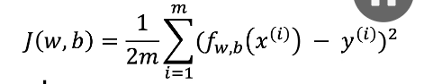

# What is Machine Learning?

Machine Learning is a subset of Artificial Intelligence (AI).

Machine Learning learns patterns from data to make predictions or decisions, and good-quality data helps the model perform better.

The input data is preprocessed by removing outliers, noisy data, and handling missing values. The model then learns patterns from the processed data and uses those patterns to predict, classify, or make decisions.

---

## Types of Machine Learning

1. Supervised Learning

2. Unsupervised Learning

4. Reinforcement Learning

---

### Supervised Learning

Supervised Learning refers to algorithms that learn mappings from input variables (X) to output variables (Y).

In supervised learning, we provide the algorithm with input data along with the correct output labels. The algorithm learns from these examples and predicts outputs for new unseen data.

Applications:

- Spam Filtering
- Speech Recognition
- Machine Translation
- Online Advertising

#### Types of Supervised Learning

1. Regression :

- Predicts continuous numerical values , infinitely many possible outputs.

- e.g.: Predicting the rate of the house with respect to area , square mtr etc.

2. Classification :

- Predict category (yes , no) small number of possible outputs.

- e.g: Predicting if the patient has breast cancer or not (yes or no).

---

### Unsupervised Learning

Unsupervised Learning finds patterns, structures, or relationships in unlabeled data.

That is suppose the clustering algorithm it takes the data unlabeled and tries to make automatically groups or clusters.

Types :

1. Clustering :

    Groups similar data points together.

2. Dimensionality reduction

    Compress data using fewer numbers.

3. Anomaly detection

    Find unusual data points.

---

## Linear Regression Model

### Example:

| Area (sq ft) | House Price |
|-------------|-------------|
| 1000 | 50,00,000 |
| 1500 | 75,00,000 |
| 2000 | 1,00,00,000 |

The goal of Linear Regression is to learn a function that maps input features (x) to output targets (y).

---

### Training Set :

    Data used to train the model.

    Notation :

    x : "input" variable feature

    y : "output" variable or "target" variable

    m : number of training examples

    eg. (x^(i) , y^(i)) - This simply means the ith data in the training set.

---

### Model Function :

                    Training Set
                        |
                Learning algorithm
                        |
        x-feature---> f (function)---> y cap (prediction)

---

## Cost Function

A linear regression cost function measures the error between a model's predictions and the actual data values. 

y (hat) - y = error